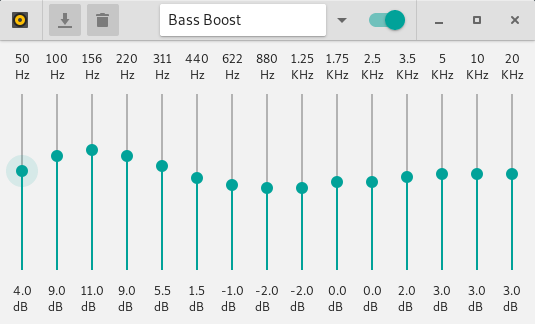

# pulseaudio-equalizer-ladspa

A LADSPA based multiband equalizer approach for getting better sound out of pulseaudio.
This equalizer clearly is more potent than the (deprecated ?), optional one from Pulseaudio.



(this screenshot was taken with the [materia theme](https://github.com/nana-4/materia-theme) enabled, it might look different on your system)

## Dependencies

 * [Meson](https://mesonbuild.com/) ≥ 0.46 & [Ninja](https://ninja-build.org/)
 * [GTK+](https://www.gtk.org/) 3
 * [Python](https://www.python.org/) ≥ 2.7 or 3
 * [PyGObject](https://pygobject.readthedocs.io/en/latest/) ≥ 3.30
 * [SWH Plugins](https://github.com/swh/ladspa)
 * [Pulseaudio](https://www.freedesktop.org/wiki/Software/PulseAudio/)
 * [bash](https://www.gnu.org/software/bash/) & [bc](https://www.gnu.org/software/bc/)


## Build & Install

```sh
meson build
cd build
ninja
(sudo) ninja install
```

## Meson options

Meson options can be set during initial configuration e.g. 
`meson build -Doptionname=value` or within the build folder with
`meson configure -Doptionname=value`.

<dl>
    <dt>python</dt>
    <dd>Per default the build system will use the same python installation as
    meson does. Set this if you want to use a specific version or binary. See
    http://mesonbuild.com/Python-module.html#find_installation for valid names
    or paths.</dt>
    <dt>purelib</dt>
    <dd>Meson defaults to install python modules to the purelib folder but some
    distributions e.g. Debian and derivatives do not set it correctly. In that
    case it needs to be manually set to the correct path relative to the prefix
    e.g. -Dpurelib=lib/python3.6/dist-packages for Ubuntu 18.10</dd>
</dl>

## Original Sources

Original Project: https://code.launchpad.net/~psyke83/+junk/pulseaudio-equalizer

Some of the presets: https://github.com/jjo/config/tree/master/.pulse

